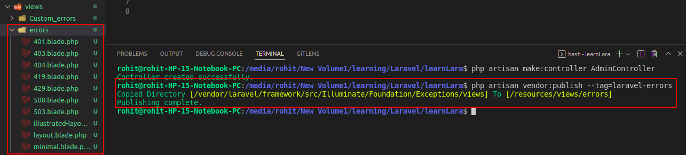

# Error pages -

## Default Error Pages

लारवेल errors के लिए default रूप से pages provide करता है लेकिन हम इन pages को customized कर सकते है। लारवेल के bydefault error pages को हम निचे दिए हुए कमांड की मदद से generate कर सकते है -

```diff
php artisan vendor:publish --tag=laravel-errors
```

यह कमांड रन करने के बाद resource के अंदर views फोल्डर में erros फोल्डर बनता है जिसके अंदर erros का ब्लेड फाइल्स generate होता है -



## Custome Error -

लारवेल हालांकि हमें डिफ़ॉल्ट रूप से erros फाइल्स provide करता है लेकिन वो इतने अच्छे नहीं होते है। जिसके कारण users खुद के errors फाइल्स बनाकर जोड़ना चाहते है। इसके लिए हमे resource/views के अंदर एक erros नाम का फोल्डर बनाना होगा उसके बाद जिस Http erros के लिए पेज बना सकते है , जैसे - 404.blade.php, 500.blade.php.


